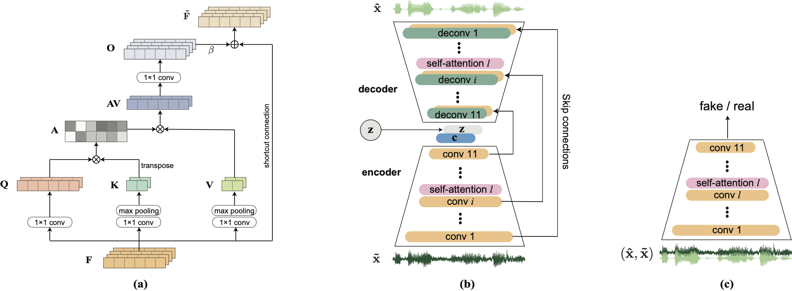
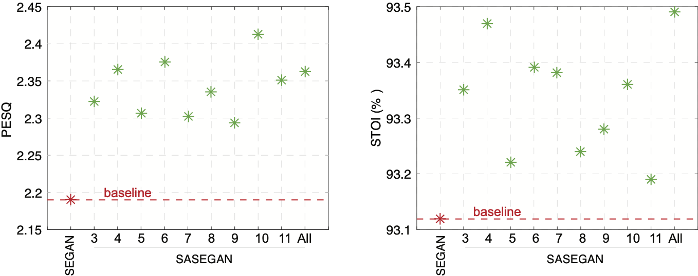
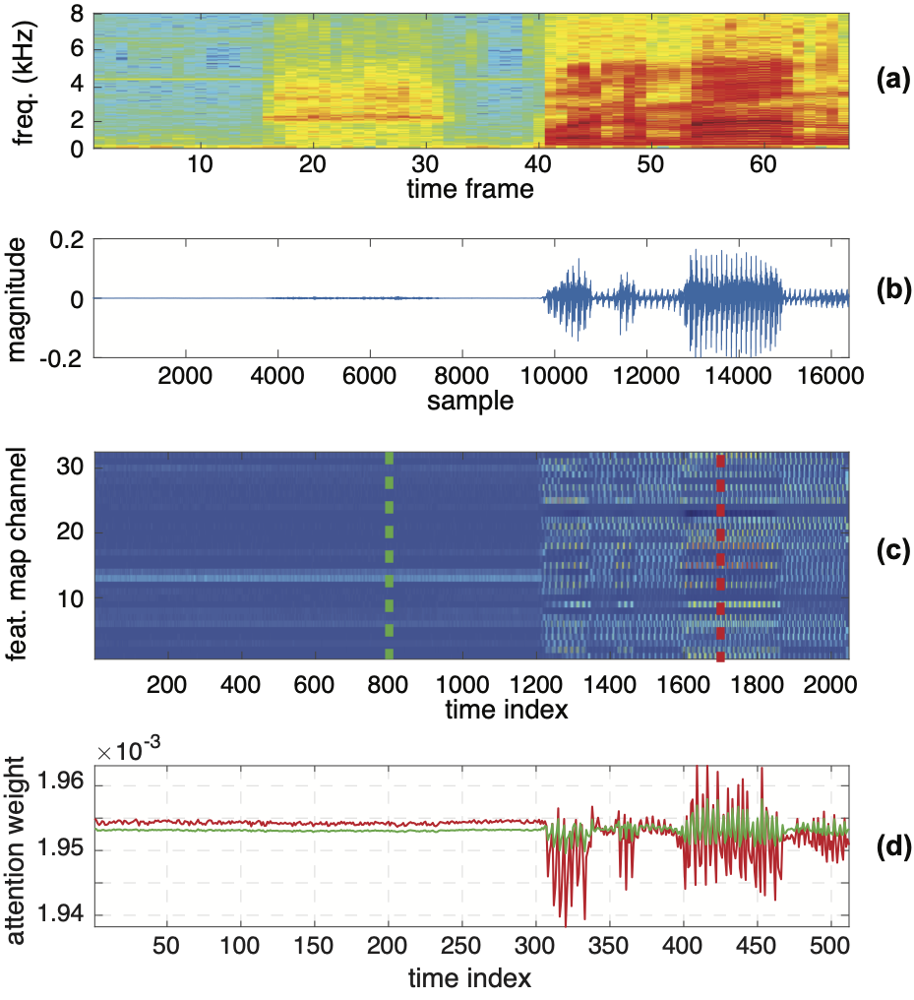

## Self-Attention Generative Adversarial Network for Speech Enhancement


### Introduction

This is the repository of the sel-attention GAN for speech enhancement (SASEGAN) in our original paper:

H. Phan, H. L. Nguyen, O. Y. Chén, P. Koch, N. Q. K. Duong, I. McLoughlin, and A. Mertins, "[_Self-Attention Generative Adversarial Network for Speech Enhancement_](https://arxiv.org/pdf/2010.09132)," arXiv preprint arXiv:2010.09132, 2020.

SASEGAN integrates non-local based self-attention to convolutional layers of SEGAN [Pascual _et al._](https://arxiv.org/abs/1703.09452) to improve sequential modelling. 

[//]: #


**The project is developed with TensorFlow 1**. ([Go to Tensorflow 2 Version](https://github.com/usimarit/sasegan))
### Dependencies

* tensorflow_gpu 1.9
* numpy==1.1.3
* scipy==1.0.0

### Data

The speech enhancement dataset used in the work can be found in [Edinburgh DataShare](http://datashare.is.ed.ac.uk/handle/10283/1942). **The following script downloads and prepares the data for TensorFlow format**:

```
./download_audio.sh
./create_training_tfrecord.sh
```

Or alternatively download the dataset, convert the wav files to 16kHz sampling and set the `noisy` and `clean` training files paths in the config file `e2e_maker.cfg` in `cfg/`. Then run the script:

```
python make_tfrecords.py --force-gen --cfg cfg/e2e_maker.cfg
```

### Training

Once you have the TFRecords file created in `data/segan.tfrecords` you can simply run the following script:

```
# SASEGAN: run inside sasegan directory
./run.sh
```
The script consists of commands for training and testing with 5 different checkpoints of the trained model on the test audio files. You may want to set the convolutional layer index (the `--att_layer_ind` parameter)where you want to have self-attention component integrated.

The trained models can be downloaded [HERE](https://zenodo.org/record/4288589)

### Results

Enhancement results compared to the SEGAN baseline:

[//]: #


Visualization of attention weights (the convolutional layer index 2) at two different time indices of the input:

[//]: #


### Reference

```
@article{phan2020sasegan,
  title={Self-Attention Generative Adversarial Network for Speech Enhancement},
  author={H. Phan, Hu. L. Nguyen, O. Y. Chén, P. Koch, N. Q. K. Duong, I. McLoughlin, and A. Mertins},
  journal={arXiv preprint arXiv:2010.09132},
  year={2020}
}
```

1. [Speech enhancement GAN](https://github.com/santi-pdp/segan)
2. [Improving GANs for speech enhancement](https://github.com/pquochuy/idsegan)
2. [Self-attention GAN](https://github.com/brain-research/self-attention-gan)

### Contact

Huy Phan 

School of Electronic Engineering and Computer Science  
Queen Mary University of London  
Email: h.phan{at}qmul.ac.uk  

### Notes

* If using this code, parts of it, or developments from it, please cite the above reference.
* We do not provide any support or assistance for the supplied code nor we offer any other compilation/variant of it.
* We assume no responsibility regarding the provided code.


### License

MIT © Huy Phan
